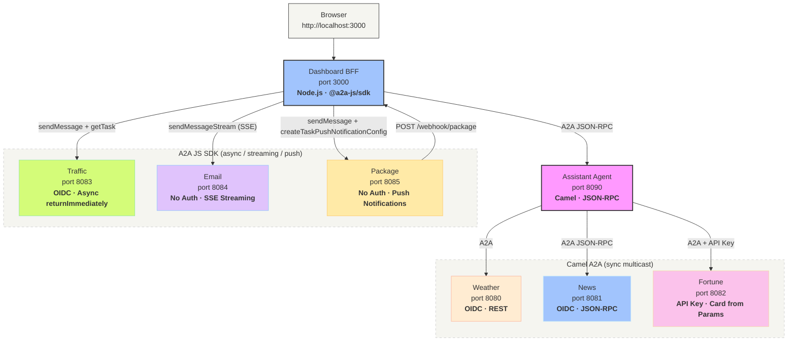

# A2A Morning Routine

A comprehensive demo showcasing the [A2A protocol](https://a2a-protocol.org) with **Apache Camel** and the **A2A JS SDK**. An assistant agent orchestrates specialist agents — each demonstrating a different A2A feature — and a Node.js dashboard serves an interactive morning briefing.

## Features at a Glance

| Agent | Port | Feature Showcased | Auth | Protocol |
|-------|------|-------------------|------|----------|
| Weather | 8080 | A2A Consumer + Producer | OIDC | REST |
| News | 8081 | JSON-RPC protocol binding | OIDC | JSON-RPC |
| Fortune | 8082 | Card from URI parameters (no JSON file) | API Key | REST |
| Traffic | 8083 | Async task lifecycle (`returnImmediately` + `GetTask` polling) | OIDC | REST |
| Email | 8084 | SSE streaming via `${a2a:emit()}` | None | JSON-RPC |
| Package | 8085 | Push notifications via webhooks | None | REST |
| Assistant | 8090 | Parallel multicast orchestration | OIDC (outbound) | JSON-RPC |
| Dashboard BFF | 3000 | A2A JS SDK client — async polling, SSE streaming, push webhooks | OIDC | — |

## Architecture

The demo uses two orchestration tiers:

1. **Camel Assistant** (port 8090) — multicasts to weather, news, and fortune agents in parallel using `camel-a2a` as a producer, aggregating responses into a single JSON briefing.
2. **Dashboard BFF** (port 3000) — a Node.js/Express server using the `@a2a-js/sdk` to call the assistant for the sync briefing and to directly interact with traffic (async polling), email (SSE streaming), and package (push notifications) agents.



## Agents

- **Weather Agent** (port 8080) — Returns mock weather data and forecasts. Demonstrates the basic **A2A consumer endpoint** with OIDC auth and REST protocol.
- **News Agent** (port 8081) — Returns mock news headlines and trending topics. Demonstrates **JSON-RPC 2.0 protocol binding** — same A2A semantics, different wire format, single config change.
- **Fortune Agent** (port 8082) — Returns random fortune cookie quotes from classic Unix `fortune` data. Demonstrates **card built from URI parameters** (no `agent-card.json` file) and **API key authentication**.
- **Traffic Agent** (port 8083) — Returns mock commute data after a simulated delay. Demonstrates the **async task lifecycle**: `returnImmediately=true` returns a SUBMITTED task instantly, the BFF polls with `getTask` until the task completes.
- **Email Agent** (port 8084) — Scans inbox and provides a prioritized email digest. Demonstrates **SSE streaming** via `${a2a:emit()}` in YAML — the agent emits progressive status events ("Connecting to inbox...", "Found 12 messages...", "Prioritizing...") during processing. No authentication.
- **Package Agent** (port 8085) — Tracks package delivery through stages. Demonstrates **push notifications** — the BFF registers a webhook via `createTaskPushNotificationConfig`, and the agent pushes status updates ("Picked up", "In transit", "Delivered!") to the webhook as the package moves. No authentication.
- **Assistant Agent** (port 8090) — Orchestrates weather, news, and fortune agents via Camel's `multicast` EIP with `parallelProcessing`, aggregates responses into a JSON object, and exposes the result as an A2A agent itself (JSON-RPC).
- **Dashboard BFF** (port 3000) — A Node.js/Express server using `@a2a-js/sdk`. Calls the assistant for the sync briefing and directly handles traffic (async polling), email (SSE proxying), and package (push webhook receiver). Serves the interactive HTML dashboard.

## How It Works

### Consumer: Exposing an A2A agent

Weather and news agents use the `camel-a2a` component as a **consumer** with a card loaded from a JSON file:

```yaml
- route:
    from:
      uri: a2a:classpath:agent-card.json
      parameters:
        oauthProfile: weather
        validateAuth: true
      steps:
        - log:
            message: "Weather agent received: ${body}"
        # ... business logic here
```

The component automatically:
- Serves the agent card at `GET /.well-known/agent-card.json`
- Exposes `POST /message:send` for receiving A2A messages
- Validates OAuth tokens on incoming requests
- Wraps the route's response in A2A protocol format

### Card from parameters

The fortune agent builds its card entirely from URI parameters — no JSON file needed:

```yaml
- route:
    from:
      uri: a2a:fortune-agent
      parameters:
        name: Fortune Cookie
        description: Random wisdom and humor from classic Unix fortune
        version: 1.0.0
        validateAuth: true
        apiKey: "{{fortune.api-key}}"
```

### Producer: Calling a remote agent

The assistant agent uses the component as a **producer** with Camel's `multicast` EIP to call agents in parallel:

```yaml
- multicast:
    parallelProcessing: true
    aggregationStrategy: "#class:MorningBriefingAggregator"
    steps:
      - to:
          uri: direct:call-weather
      - to:
          uri: direct:call-news
      - to:
          uri: direct:call-fortune
```

Each downstream call uses the A2A producer:

```yaml
- to:
    uri: a2a:http://localhost:8080
    parameters:
      oauthProfile: assistant
```

The producer automatically fetches the agent card, wraps the message in A2A protocol format, acquires an OAuth token, and returns a `Task` object.

### Async task lifecycle

The traffic agent demonstrates async processing — it returns immediately and does the work in the background:

```yaml
- route:
    from:
      uri: a2a:classpath:agent-card.json
      parameters:
        returnImmediately: true
        asyncTimeout: 30000
      steps:
        - delay:
            constant: 5000
        - setBody:
            simple: "Commute report..."
```

The Dashboard BFF polls using the A2A JS SDK until the task completes:

```typescript
// Submit with returnImmediately
const result = await client.sendMessage({
  message: ...,
  configuration: { returnImmediately: true },
});

// Poll for completion
const task = await client.getTask({ id: taskId });
```

### SSE streaming

The email agent emits progressive status events using `${a2a:emit()}` in pure YAML:

```yaml
- script:
    simple: "${a2a:emit('Connecting to inbox...')}"
- delay:
    simple: ${random(1500, 4500)}
- script:
    simple: "${a2a:emit('Found 12 unread messages...')}"
```

The Dashboard BFF receives events via the A2A JS SDK's `sendMessageStream`:

```typescript
for await (const event of client.sendMessageStream({ message })) {
  res.write(`data: ${JSON.stringify(StreamResponse.toJSON(event))}\n\n`);
}
```

### Push notifications

The package agent uses `returnImmediately=true` and emits delivery stages via `${a2a:emit()}`, triggering push notification dispatch to registered webhooks:

```yaml
- route:
    from:
      uri: a2a:classpath:agent-card.json
      parameters:
        returnImmediately: true
        asyncTimeout: 60000
      steps:
        - script:
            simple: "${a2a:emit('Package picked up from warehouse')}"
        - delay:
            simple: ${random(1500, 4500)}
        - script:
            simple: "${a2a:emit('In transit...')}"
        # ... more stages
```

The BFF registers a webhook and receives updates:

```typescript
// Register webhook for push notifications
await client.createTaskPushNotificationConfig({
  taskId,
  url: 'http://localhost:3000/webhook/package',
});

// Webhook handler receives pushed updates
app.post('/webhook/package', (req, res) => {
  const event = StreamResponse.fromJSON(req.body);
  // ... process delivery stage update
});
```

## Prerequisites

- [Camel JBang](https://camel.apache.org/manual/camel-jbang.html) installed (`jbang app install camel@apache/camel`)
- [Node.js](https://nodejs.org/) 18+ (for the Dashboard BFF)
- [Podman](https://podman.io/) and `podman-compose` (for Keycloak)
- Apache Camel 4.21.0+ (requires `camel-a2a` and `camel-oauth` components)
- No LLM or database needed

## Quick Start

```bash
# Start all agents + dashboard
./start.sh

# Open the dashboard in your browser
open http://localhost:3000/

# Or fetch the briefing data via curl
curl -s http://localhost:3000/api/morning-briefing | jq

# Stop everything
./stop.sh
```

## Explore Agent Cards

Each agent exposes its capabilities via the A2A agent card endpoint:

```bash
# Weather agent card (with skills: current-weather, forecast)
curl -s http://localhost:8080/.well-known/agent-card.json | jq

# News agent card (with skills: headlines, trending)
curl -s http://localhost:8081/.well-known/agent-card.json | jq

# Fortune agent card (built from URI params — no JSON file!)
curl -s http://localhost:8082/.well-known/agent-card.json | jq
```

## Direct A2A Calls

You can also call individual agents directly via the A2A protocol. First obtain a token from Keycloak:

```bash
# Get an access token from Keycloak
TOKEN=$(curl -s -X POST http://localhost:8180/realms/a2a-morning-routine/protocol/openid-connect/token \
  -d "grant_type=client_credentials" \
  -d "client_id=assistant-agent" \
  -d "client_secret=assistant-agent-secret" | jq -r '.access_token')

# Call weather agent directly via A2A message:send
curl -s -X POST http://localhost:8080/message:send \
  -H "Content-Type: application/json" \
  -H "Authorization: Bearer $TOKEN" \
  -d '{
    "message": {
      "role": "user",
      "parts": [{"text": "What is the weather?"}]
    }
  }' | jq

# Call news agent directly (JSON-RPC)
curl -s -X POST http://localhost:8081/ \
  -H "Content-Type: application/json" \
  -H "Authorization: Bearer $TOKEN" \
  -d '{
    "jsonrpc": "2.0",
    "id": "1",
    "method": "SendMessage",
    "params": {
      "message": {"role": "user", "parts": [{"text": "What is trending?"}]}
    }
  }' | jq

# Call fortune agent directly (API key auth)
curl -s -X POST http://localhost:8082/message:send \
  -H "Content-Type: application/json" \
  -H "X-API-Key: LU6NiAYEsEvKsL-KsQvw-6w6x3pYyR37kvLtsyQRpm4" \
  -d '{
    "message": {
      "role": "user",
      "parts": [{"text": "Give me a fortune"}]
    }
  }' | jq
```

## Key Concepts Demonstrated

1. **A2A Consumer Endpoint** — Agents declare capabilities in `agent-card.json` and expose them via `from("a2a:classpath:agent-card.json")`
2. **A2A Producer Endpoint** — The assistant calls agents via `to("a2a:http://host:port")` with automatic card discovery and protocol wrapping
3. **Card from Parameters** — The fortune agent builds its agent card entirely from URI params — no JSON file needed
4. **JSON-RPC Protocol Binding** — The news and email agents use `protocolBinding=jsonrpc`, showing protocol flexibility with a single config change
5. **Parallel Multicast** — Camel's `multicast` EIP with `parallelProcessing` calls agents concurrently and aggregates results
6. **Mixed Authentication** — OIDC (weather, news, traffic), API key (fortune), and none (email, package) — the producer adapts automatically based on each agent's card
7. **Async Task Lifecycle** — The traffic agent uses `returnImmediately=true` to return a SUBMITTED task instantly; the BFF polls with `getTask` showing SUBMITTED -> WORKING -> COMPLETED transitions
8. **SSE Streaming** — The email agent uses `${a2a:emit()}` to emit progressive status events; the BFF proxies them to the browser via `sendMessageStream`
9. **Push Notifications** — The package agent pushes delivery updates to a webhook registered by the BFF via `createTaskPushNotificationConfig`; the dashboard shows toast notifications for each stage
10. **A2A JS SDK** — The Dashboard BFF demonstrates the JavaScript/TypeScript A2A client library with OIDC auth, streaming, and push notification support

## Project Structure

```
camel-a2a-morning-routine/
├── config/
│   └── keycloak-realm.json              # Keycloak realm with agent clients
├── weather-agent/
│   ├── agent-card.json                  # Agent card with skills + OIDC security
│   ├── application.properties           # Port 8080, OAuth profile
│   └── routes.camel.yaml               # A2A consumer + weather responses
├── news-agent/
│   ├── agent-card.json                  # Agent card with skills + OIDC security
│   ├── application.properties           # Port 8081, OAuth profile
│   └── routes.camel.yaml               # A2A consumer + JSON-RPC + news responses
├── fortune-agent/
│   ├── fortunes.txt                     # Classic Unix fortune data (2,800+ quotes)
│   ├── FortuneService.java             # Loads fortunes, returns random one
│   ├── application.properties           # Port 8082, API key auth
│   └── routes.camel.yaml               # A2A consumer — card built from URI params
├── traffic-agent/
│   ├── agent-card.json                  # Agent card with OIDC security
│   ├── application.properties           # Port 8083, OAuth profile
│   └── routes.camel.yaml               # A2A consumer + async returnImmediately
├── email-agent/
│   ├── agent-card.json                  # Agent card, no security, streaming capable
│   ├── application.properties           # Port 8084, no OAuth
│   └── routes.camel.yaml               # A2A consumer + JSON-RPC + SSE via ${a2a:emit()}
├── package-agent/
│   ├── agent-card.json                  # Agent card, no security, push capable
│   ├── PackageDeliverySimulator.java    # Processor emitting delivery stages via A2AProgress
│   ├── application.properties           # Port 8085, no OAuth
│   └── routes.camel.yaml               # A2A consumer + async + push via ${a2a:emit()}
├── assistant/
│   ├── agent-card.json                  # Agent card for the orchestrator
│   ├── MorningBriefingAggregator.java   # Aggregates weather+news+fortune into JSON
│   ├── dashboard.html                   # Static dashboard HTML (served by BFF)
│   ├── application.properties           # Port 8090, OAuth profile
│   └── routes.camel.yaml               # Multicast to weather, news, fortune
├── dashboard/
│   ├── package.json                     # Node.js BFF using @a2a-js/sdk + Express
│   ├── tsconfig.json                    # TypeScript configuration
│   ├── public/
│   │   └── dashboard.html               # Interactive dashboard with live updates
│   └── src/
│       ├── index.ts                     # Express server entry point
│       ├── config.ts                    # Agent URLs, Keycloak config, BFF port
│       ├── routes/
│       │   ├── briefing.ts              # /api/morning-briefing → calls assistant
│       │   ├── traffic.ts               # /api/traffic-submit + /api/traffic-status (GetTask polling)
│       │   ├── email.ts                 # /api/email-stream (SSE proxy via sendMessageStream)
│       │   └── package.ts              # /api/package-track + /webhook/package (push notifications)
│       └── services/
│           ├── a2a-clients.ts           # A2A JS SDK client factory (plain + OIDC)
│           ├── oidc.ts                  # Keycloak token management with caching
│           └── package-store.ts         # In-memory store for push notification stages
├── podman-compose.yml                   # Keycloak container
├── start.sh                             # Start Keycloak + all agents + dashboard
├── stop.sh                              # Stop all agents + dashboard + Keycloak
├── restart.sh                           # Restart agents (keeps Keycloak running)
└── README.md
```
