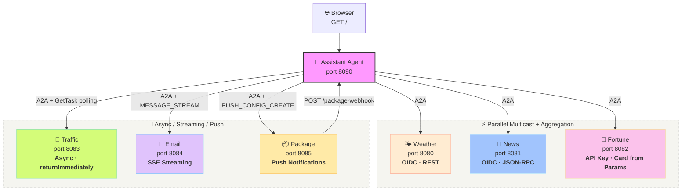

# A2A Morning Routine

A comprehensive demo showcasing the Apache Camel `camel-a2a` component for agent-to-agent communication using the [A2A protocol](https://a2a-protocol.org).

An assistant agent orchestrates 7 specialist agents — each demonstrating a different A2A feature — and serves an interactive HTML morning briefing dashboard.

## Features at a Glance

| Agent | Port | Feature Showcased | Auth | Protocol |
|-------|------|-------------------|------|----------|
| Weather | 8080 | A2A Consumer + Producer | OIDC | REST |
| News | 8081 | JSON-RPC protocol binding | OIDC | JSON-RPC |
| Fortune | 8082 | Card from URI parameters (no JSON file) | API Key | REST |
| Traffic | 8083 | Async task lifecycle (`returnImmediately` + `GetTask` polling) | OIDC | REST |
| Email | 8084 | SSE streaming via `A2AStreamEmitter` | OIDC | JSON-RPC |
| Package | 8085 | Push notifications via webhooks | None | REST |
| Assistant | 8090 | Parallel multicast orchestration + HTML dashboard | OIDC | — |

## Architecture



## Agents

- **Weather Agent** (port 8080) — Returns mock weather data and forecasts. Demonstrates the basic **A2A consumer endpoint** with OIDC auth and REST protocol.
- **News Agent** (port 8081) — Returns mock news headlines and trending topics. Demonstrates **JSON-RPC 2.0 protocol binding** — same A2A semantics, different wire format, single config change.
- **Fortune Agent** (port 8082) — Returns random fortune cookie quotes from classic Unix `fortune` data. Demonstrates **card built from URI parameters** (no `agent-card.json` file) and **API key authentication**.
- **Traffic Agent** (port 8083) — Returns mock commute data after a simulated delay. Demonstrates the **async task lifecycle**: `returnImmediately=true` returns a SUBMITTED task instantly, the assistant polls with `GetTask` until the task transitions through WORKING → COMPLETED.
- **Email Agent** (port 8084) — Scans inbox and provides a prioritized email digest. Demonstrates **SSE streaming** via `A2AStreamEmitter` — the agent emits progressive status events ("Connecting to inbox...", "Found 12 messages...", "Prioritizing...") during processing.
- **Package Agent** (port 8085) — Tracks package delivery through stages. Demonstrates **push notifications** — the assistant registers a webhook via `PUSH_CONFIG_CREATE`, and the agent pushes status updates ("Picked up", "In transit", "Delivered!") to the webhook as the package moves.
- **Assistant Agent** (port 8090) — Orchestrates all agents via Camel's `multicast` EIP with `parallelProcessing`, aggregates responses, and serves an interactive HTML dashboard with live status updates.

## How It Works

### Consumer: Exposing an A2A agent

Weather and news agents use the `camel-a2a` component as a **consumer** with a card loaded from a JSON file:

```yaml
- route:
    from:
      uri: a2a:classpath:agent-card.json
      parameters:
        oauthProfile: weather
        validateAuth: true
      steps:
        - log:
            message: "Weather agent received: ${body}"
        # ... business logic here
```

The component automatically:
- Serves the agent card at `GET /.well-known/agent-card.json`
- Exposes `POST /message:send` for receiving A2A messages
- Validates OAuth tokens on incoming requests
- Wraps the route's response in A2A protocol format

### Card from parameters

The fortune agent builds its card entirely from URI parameters — no JSON file needed:

```yaml
- route:
    from:
      uri: a2a:fortune-agent
      parameters:
        name: Fortune Cookie
        description: Random wisdom and humor
        version: 1.0.0
        validateAuth: true
        apiKey: "{{fortune.api-key}}"
```

### Producer: Calling a remote agent

The assistant agent uses the component as a **producer** with Camel's `multicast` EIP to call agents in parallel:

```yaml
- multicast:
    parallelProcessing: true
    aggregationStrategy: "#class:MorningBriefingAggregator"
    steps:
      - to:
          uri: direct:call-weather
      - to:
          uri: direct:call-news
      - to:
          uri: direct:call-fortune
```

Each downstream call uses the A2A producer:

```yaml
- to:
    uri: a2a:http://localhost:8080
    parameters:
      oauthProfile: assistant
```

The producer automatically fetches the agent card, wraps the message in A2A protocol format, acquires an OAuth token, and returns a `Task` object.

### Async task lifecycle

The traffic agent demonstrates async processing — it returns immediately and does the work in the background:

```yaml
- route:
    from:
      uri: a2a:classpath:agent-card.json
      parameters:
        returnImmediately: true
        asyncTimeout: 30000
      steps:
        - delay:
            constant: 4000
        - setBody:
            simple: "Commute report..."
```

The assistant polls until the task completes:

```yaml
- setHeader:
    name: CamelA2AOperation
    constant: GetTask
- setHeader:
    name: CamelA2ATaskId
    simple: "${variable.taskId}"
- to: a2a:http://localhost:8083
```

### SSE streaming

The email agent streams progressive status events during processing:

```java
A2AStreamEmitter emitter = exchange.getIn().getHeader(
        "CamelA2AStreamEmitter", A2AStreamEmitter.class);

emitter.emitStatus(TaskState.WORKING, "Connecting to inbox...");
Thread.sleep(1500);
emitter.emitStatus(TaskState.WORKING, "Found 12 unread messages...");
```

The assistant receives events via `MESSAGE_STREAM` operation and animates them in the dashboard.

### Push notifications

The package agent uses `returnImmediately=true` and updates the task store at each delivery stage, triggering push notification dispatch to registered webhooks:

```yaml
# Assistant registers a webhook
- setHeader:
    name: CamelA2AOperation
    constant: PUSH_CONFIG_CREATE
- setBody:
    simple: "${bean:pushConfigBuilder?method=build}"
- to: a2a:http://localhost:8085
```

The agent pushes delivery updates to the webhook. The dashboard shows both live card updates and toast notifications.

## Prerequisites

- [Camel JBang](https://camel.apache.org/manual/camel-jbang.html) installed (`jbang app install camel@apache/camel`)
- [Podman](https://podman.io/) and `podman-compose` (for Keycloak)
- Apache Camel 4.21.0+ (requires `camel-a2a` and `camel-oauth` components)
- No LLM or database needed

## Quick Start

```bash
# Start all agents
./start.sh

# Open the dashboard in your browser
open http://localhost:8090/

# Or fetch the briefing data via curl
curl -s http://localhost:8090/morning-briefing | jq

# Stop all agents
./stop.sh
```

## Explore Agent Cards

Each agent exposes its capabilities via the A2A agent card endpoint:

```bash
# Weather agent card (with skills: current-weather, forecast)
curl -s http://localhost:8080/.well-known/agent-card.json | jq

# News agent card (with skills: headlines, trending)
curl -s http://localhost:8081/.well-known/agent-card.json | jq

# Fortune agent card (built from URI params — no JSON file!)
curl -s http://localhost:8082/.well-known/agent-card.json | jq

# List registered agents
curl -s http://localhost:8090/agents | jq
```

## Direct A2A Calls

You can also call individual agents directly via the A2A protocol. First obtain a token from Keycloak:

```bash
# Get an access token from Keycloak
TOKEN=$(curl -s -X POST http://localhost:8180/realms/a2a-morning-routine/protocol/openid-connect/token \
  -d "grant_type=client_credentials" \
  -d "client_id=assistant-agent" \
  -d "client_secret=assistant-agent-secret" | jq -r '.access_token')

# Call weather agent directly via A2A message:send
curl -s -X POST http://localhost:8080/message:send \
  -H "Content-Type: application/json" \
  -H "Authorization: Bearer $TOKEN" \
  -d '{
    "message": {
      "role": "user",
      "parts": [{"text": "What is the weather?"}]
    }
  }' | jq

# Call news agent directly (JSON-RPC)
curl -s -X POST http://localhost:8081/ \
  -H "Content-Type: application/json" \
  -H "Authorization: Bearer $TOKEN" \
  -d '{
    "jsonrpc": "2.0",
    "id": "1",
    "method": "SendMessage",
    "params": {
      "message": {"role": "user", "parts": [{"text": "What is trending?"}]}
    }
  }' | jq

# Call fortune agent directly (API key auth)
curl -s -X POST http://localhost:8082/message:send \
  -H "Content-Type: application/json" \
  -H "X-API-Key: LU6NiAYEsEvKsL-KsQvw-6w6x3pYyR37kvLtsyQRpm4" \
  -d '{
    "message": {
      "role": "user",
      "parts": [{"text": "Give me a fortune"}]
    }
  }' | jq
```

## Key Concepts Demonstrated

1. **A2A Consumer Endpoint** — Agents declare capabilities in `agent-card.json` and expose them via `from("a2a:classpath:agent-card.json")`
2. **A2A Producer Endpoint** — The assistant calls agents via `to("a2a:http://host:port")` with automatic card discovery and protocol wrapping
3. **Card from Parameters** — The fortune agent builds its agent card entirely from URI params — no JSON file needed
4. **JSON-RPC Protocol Binding** — The news and email agents use `protocolBinding=jsonrpc`, showing protocol flexibility with a single config change
5. **Parallel Multicast** — Camel's `multicast` EIP with `parallelProcessing` calls agents concurrently and aggregates results
6. **Response Extraction** — A `SimpleFunction` extracts text from A2A `Task` objects using the `~>` chain operator
7. **Mixed Authentication** — OIDC (weather, news, traffic, email), API key (fortune), and none (package) — the producer adapts automatically based on each agent's card
8. **Async Task Lifecycle** — The traffic agent uses `returnImmediately=true` to return a SUBMITTED task instantly; the dashboard polls with `GetTask` showing SUBMITTED → WORKING → COMPLETED transitions
9. **SSE Streaming** — The email agent uses `A2AStreamEmitter` to emit progressive status events; the dashboard animates them line by line
10. **Push Notifications** — The package agent pushes delivery updates to a webhook registered via `PUSH_CONFIG_CREATE`; the dashboard shows toast notifications for each stage

## Project Structure

```
camel-a2a-morning-routine/
├── config/
│   └── keycloak-realm.json          # Keycloak realm with agent clients
├── weather-agent/
│   ├── agent-card.json              # Agent card with skills + OIDC security
│   ├── application.properties       # Port 8080, OAuth profile
│   └── routes.camel.yaml            # A2A consumer + weather responses
├── news-agent/
│   ├── agent-card.json              # Agent card with skills + OIDC security
│   ├── application.properties       # Port 8081, OAuth profile
│   └── routes.camel.yaml            # A2A consumer + JSON-RPC + news responses
├── fortune-agent/
│   ├── fortunes.txt                 # Classic Unix fortune data (2,800+ quotes)
│   ├── FortuneService.java          # Loads fortunes, returns random one
│   ├── application.properties       # Port 8082, API key auth
│   └── routes.camel.yaml            # A2A consumer — card built from URI params
├── traffic-agent/
│   ├── agent-card.json              # Agent card with OIDC security
│   ├── TaskStateUpdater.java        # Updates task store to WORKING state
│   ├── application.properties       # Port 8083, OAuth profile
│   └── routes.camel.yaml            # A2A consumer + async returnImmediately
├── email-agent/
│   ├── agent-card.json              # Agent card with OIDC security
│   ├── EmailDigestProcessor.java    # Processor using A2AStreamEmitter
│   ├── application.properties       # Port 8084, OAuth profile
│   └── routes.camel.yaml            # A2A consumer + JSON-RPC + SSE streaming
├── package-agent/
│   ├── agent-card.json              # Agent card, no security
│   ├── PackageDeliverySimulator.java # Processor simulating delivery stages
│   ├── application.properties       # Port 8085, no OAuth
│   └── routes.camel.yaml            # A2A consumer + async + push notifications
├── assistant/
│   ├── A2AResponseExtractor.java    # SimpleFunction: extracts text from Task/Message
│   ├── MorningBriefingAggregator.java # Aggregates sync agents into JSON
│   ├── TrafficStatusExtractor.java  # Extracts task status for traffic polling
│   ├── EmailStreamExtractor.java    # Extracts SSE events into JSON
│   ├── PackageStatusStore.java      # In-memory store for push notification status
│   ├── PackageWebhookProcessor.java # Processes incoming webhook POSTs
│   ├── PushConfigBuilder.java       # Builds webhook registration config
│   ├── DashboardPage.java           # Loads and caches dashboard HTML
│   ├── dashboard.html               # Interactive dashboard with live updates
│   ├── application.properties       # Port 8090, OAuth profile
│   └── routes.camel.yaml            # Dashboard + multicast + async + streaming + push routes
├── podman-compose.yml               # Keycloak container
├── start.sh                         # Start Keycloak + all agents
├── stop.sh                          # Stop all agents + Keycloak
└── README.md
```
