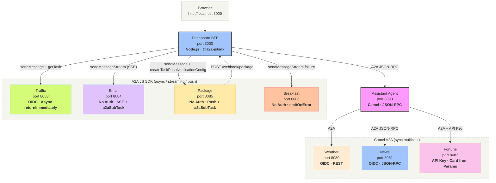

# A2A Morning Routine

A comprehensive demo showcasing the [A2A protocol](https://a2a-protocol.org) with **Apache Camel** and the **A2A JS SDK**. An assistant agent orchestrates specialist agents — each demonstrating a different A2A feature — and a Node.js dashboard serves an interactive morning briefing.

## Features at a Glance

| Agent | Port | Feature Showcased | Auth | Protocol |
|-------|------|-------------------|------|----------|
| Weather | 8080 | `dataFormat=POJO` + `${a2a:text}` extraction | OIDC | REST |
| News | 8081 | JSON-RPC protocol binding | OIDC | JSON-RPC |
| Fortune | 8082 | Card from URI parameters (no JSON file) | API Key | REST |
| Traffic | 8083 | Async task lifecycle + `maxConcurrentTasks` capacity limiting | OIDC | REST |
| Email | 8084 | SSE streaming via `a2aSubTask` scoped progress | None | JSON-RPC |
| Package | 8085 | Push notifications via `a2aSubTask` scoped progress | None | REST |
| Breakfast | 8086 | `a2aSubTask emitOnError` failure progress | None | JSON-RPC |
| Assistant | 8090 | Parallel multicast orchestration + `historyLength` | OIDC (outbound) | JSON-RPC |
| Dashboard BFF | 3000 | A2A JS SDK client — async polling, SSE/error streaming, push webhooks | OIDC | — |

## Architecture

The demo uses two orchestration tiers:

1. **Camel Assistant** (port 8090) — multicasts to weather, news, and fortune agents in parallel using `camel-a2a` as a producer, aggregating responses into a single JSON briefing.
2. **Dashboard BFF** (port 3000) — a Node.js/Express server using the `@a2a-js/sdk` to call the assistant for the sync briefing and to directly interact with traffic (async polling), email (SSE streaming), package (push notifications), and breakfast (failure streaming) agents.



## Agents

### Weather Agent (port 8080)

Returns mock weather data and forecasts. The primary showcase for **data format modes** and **card-access Simple functions**.

| Feature | Config / Usage | Description |
|---------|---------------|-------------|
| A2A Consumer | `from: a2a:classpath:agent-card.json` | Exposes the agent as an A2A endpoint with auto-registered HTTP routes |
| `dataFormat=POJO` | `dataFormat: POJO` | Body is the full `Message` object (with `role`, `parts`, `metadata`) instead of extracted text |
| `${a2a:text}` | `${a2a:text} contains 'forecast'` | Extracts the first `TextPart` from the `Message` body — works with any data format |
| `${a2a:card.name}` | `${a2a:card.name} received: ...` | Resolves the agent name from the card at runtime for log messages |
| OIDC authentication | `oauthProfile: weather`, `validateAuth: true` | Validates incoming tokens via Keycloak and acquires tokens for outbound calls |
| Agent card from file | `agent-card.json` | Card with skills, OIDC security scheme, and `supportedInterfaces` |

### News Agent (port 8081)

Returns mock news headlines and trending topics. The primary showcase for **JSON-RPC protocol binding**.

| Feature | Config / Usage | Description |
|---------|---------------|-------------|
| A2A Consumer | `from: a2a:classpath:agent-card.json` | Standard consumer endpoint |
| `protocolBinding=jsonrpc` | `protocolBinding: jsonrpc` | All A2A operations go through a single `POST /` endpoint with JSON-RPC 2.0 envelopes instead of REST paths |
| `${a2a:card.name}` | `${a2a:card.name} received: ...` | Dynamic agent name in log messages |
| OIDC authentication | `oauthProfile: news`, `validateAuth: true` | Token validation via Keycloak |

### Fortune Agent (port 8082)

Returns random fortune cookie quotes from classic Unix `fortune` data. The primary showcase for **card from URI parameters** and **API key auth**.

| Feature | Config / Usage | Description |
|---------|---------------|-------------|
| Card from parameters | `a2a:fortune-agent` + `name`, `description`, `version` params | No `agent-card.json` file — the card is built entirely from URI parameters at startup |
| API key authentication | `apiKey: "{{fortune.api-key}}"`, `validateAuth: true` | Incoming requests must include the API key; the consumer validates it automatically |
| `${a2a:card.name}` | `${a2a:card.name} received: ...` | Resolves `name` from the URI parameter override (`Fortune Cookie`) |
| Bean integration | `${bean:fortuneService?method=getRandomFortune}` | Calls a Java `@BindToRegistry` bean from the YAML route |

### Traffic Agent (port 8083)

Returns mock commute data after a simulated delay. The primary showcase for **async task lifecycle** and **capacity limiting**.

| Feature | Config / Usage | Description |
|---------|---------------|-------------|
| A2A Consumer | `from: a2a:classpath:agent-card.json` | Standard consumer endpoint |
| `returnImmediately` | `returnImmediately: true` | Returns a SUBMITTED task instantly; processing continues in the background. Clients poll with `GetTask` until COMPLETED |
| `asyncTimeout` | `asyncTimeout: 30000` | Maximum time (ms) for async task completion before timeout |
| `maxConcurrentTasks` | `maxConcurrentTasks: 2` | Limits parallel route executions to 2 — excess requests get HTTP 429 (ServerBusyError) |
| OIDC authentication | `oauthProfile: traffic`, `validateAuth: true` | Token validation via Keycloak |

### Email Agent (port 8084)

Scans inbox and provides a prioritized email digest. The primary showcase for **SSE streaming** and scoped progress events with **`a2aSubTask`** in pure YAML.

| Feature | Config / Usage | Description |
|---------|---------------|-------------|
| A2A Consumer | `from: a2a:classpath:agent-card.json` | Standard consumer endpoint |
| `protocolBinding=jsonrpc` | `protocolBinding: jsonrpc` | JSON-RPC 2.0 wire format |
| `httpServerComponent` | `httpServerComponent: undertow` | Uses Undertow instead of the default platform-http for SSE streaming support |
| `a2aSubTask` | `emitBefore`, `emitAfter`, `emitOnError` | Emits progressive WORKING status events around nested route steps — clients see real-time progress |
| Streaming capability | `"capabilities": {"streaming": true}` in card | Advertises SSE streaming support in the agent card |
| No authentication | No `validateAuth` or auth params | Intentionally open for demo simplicity |

### Package Agent (port 8085)

Tracks package delivery through stages. The primary showcase for **push notifications** via webhooks and scoped delivery progress with **`a2aSubTask`**.

| Feature | Config / Usage | Description |
|---------|---------------|-------------|
| A2A Consumer | `from: a2a:classpath:agent-card.json` | Standard consumer endpoint |
| `returnImmediately` | `returnImmediately: true` | Returns SUBMITTED immediately; delivery stages process in the background |
| `asyncTimeout` | `asyncTimeout: 60000` | Longer timeout (60s) for multi-stage delivery simulation |
| `a2aSubTask` | `emitBefore`, `emitAfter`, `emitOnError` | Emits delivery stage updates around nested route steps — triggers push notification dispatch to registered webhooks |
| Push notifications | `"capabilities": {"pushNotifications": true}` in card | Advertises push capability; clients register webhooks via `createTaskPushNotificationConfig` |
| Pure YAML agent | No Java code | All delivery stages handled with YAML `a2aSubTask` + `delay` steps |

### Breakfast Agent (port 8086)

Intentionally fails while preparing breakfast. The primary showcase for **`emitOnError`** and exception propagation from an `a2aSubTask`.

| Feature | Config / Usage | Description |
|---------|---------------|-------------|
| A2A Consumer | `from: a2a:classpath:agent-card.json` | Standard consumer endpoint |
| `protocolBinding=jsonrpc` | `protocolBinding: jsonrpc` | JSON-RPC 2.0 wire format |
| `httpServerComponent` | `httpServerComponent: undertow` | Uses Undertow for streaming support |
| `a2aSubTask emitOnError` | `emitOnError: "Coffee subtask failed: ${exception.message}"` | Emits a progress event when a nested step fails |
| Original exception propagation | `throwException: java.lang.IllegalStateException` | The error event is emitted, then the original route exception still fails the task |
| Streaming capability | `"capabilities": {"streaming": true}` in card | Lets the dashboard receive the error progress event before the stream failure |

### Assistant Agent (port 8090)

Orchestrates weather, news, and fortune agents into a morning briefing. The primary showcase for the **A2A producer**, **parallel multicast**, and **history management**.

| Feature | Config / Usage | Description |
|---------|---------------|-------------|
| A2A Consumer | `from: a2a:classpath:agent-card.json` | Exposes the orchestrator as an A2A agent itself |
| A2A Producer | `to: a2a:http://localhost:8080` | Calls remote agents with automatic card discovery, protocol wrapping, and auth |
| `protocolBinding=jsonrpc` | `protocolBinding: jsonrpc` | JSON-RPC for inbound requests |
| `httpServerComponent` | `httpServerComponent: undertow` | Undertow as the HTTP server |
| `historyLength` | `historyLength: 10` | Caps multi-turn conversation context to 10 messages |
| `oauthProfile` (producer) | `oauthProfile: assistant` on `to:` URIs | Acquires OAuth tokens for outbound calls to OIDC-protected agents |
| `apiKey` (producer) | `apiKey: ...` on fortune call | Sends API key when calling the fortune agent |
| Parallel multicast | `multicast: parallelProcessing: true` | Calls weather, news, and fortune agents concurrently using Camel's multicast EIP |
| Custom aggregation | `MorningBriefingAggregator.java` | Collects 3 responses and serializes them as a JSON object |
| `${a2a:text}` (producer) | `${a2a:text}` in log steps | Extracts text from the `Task` response returned by the producer |
| Mixed protocol calls | REST (weather), JSON-RPC (news), REST (fortune) | Producer adapts protocol per agent based on endpoint config |

### Dashboard BFF (port 3000)

A Node.js/Express server using `@a2a-js/sdk`. Not a Camel agent — demonstrates the **A2A JS SDK** client library.

| Feature | Usage | Description |
|---------|-------|-------------|
| Sync briefing | `client.sendMessage()` → assistant | Calls the assistant and waits for the aggregated response |
| Async polling | `client.sendMessage()` + `client.getTask()` → traffic | Submits with `returnImmediately`, polls until COMPLETED |
| SSE streaming | `client.sendMessageStream()` → email | Receives progressive status events in real-time |
| Push notifications | `client.createTaskPushNotificationConfig()` → package | Registers a webhook, receives delivery stages via POST callbacks |
| Error streaming | `client.sendMessageStream()` → breakfast | Shows the `emitOnError` progress event, then displays the propagated task failure |
| OIDC token management | `oidc.ts` | Acquires and caches Keycloak tokens for authenticated agent calls |

## How It Works

### Consumer: Exposing an A2A agent

Weather and news agents use the `camel-a2a` component as a **consumer** with a card loaded from a JSON file. The weather agent uses `dataFormat=POJO` so the body is a full `Message` object, and `${a2a:text}` to extract text content:

```yaml
- route:
    from:
      uri: a2a:classpath:agent-card.json
      parameters:
        oauthProfile: weather
        validateAuth: true
        dataFormat: POJO
      steps:
        - log:
            message: "${a2a:card.name} received: ${a2a:text}"
        # ... business logic here
```

The component automatically:
- Serves the agent card at `GET /.well-known/agent-card.json`
- Exposes `POST /message:send` for receiving A2A messages
- Validates OAuth tokens on incoming requests
- Wraps the route's response in A2A protocol format

### Card from parameters

The fortune agent builds its card entirely from URI parameters — no JSON file needed:

```yaml
- route:
    from:
      uri: a2a:fortune-agent
      parameters:
        name: Fortune Cookie
        description: Random wisdom and humor from classic Unix fortune
        version: 1.0.0
        validateAuth: true
        apiKey: "{{fortune.api-key}}"
```

### Producer: Calling a remote agent

The assistant agent uses the component as a **producer** with Camel's `multicast` EIP to call agents in parallel:

```yaml
- multicast:
    parallelProcessing: true
    aggregationStrategy: "#class:MorningBriefingAggregator"
    steps:
      - to:
          uri: direct:call-weather
      - to:
          uri: direct:call-news
      - to:
          uri: direct:call-fortune
```

Each downstream call uses the A2A producer:

```yaml
- to:
    uri: a2a:http://localhost:8080
    parameters:
      oauthProfile: assistant
```

The producer automatically fetches the agent card, wraps the message in A2A protocol format, acquires an OAuth token, and returns a `Task` object.

### Async task lifecycle

The traffic agent demonstrates async processing with capacity limiting — it returns immediately, does the work in the background, and limits concurrent tasks:

```yaml
- route:
    from:
      uri: a2a:classpath:agent-card.json
      parameters:
        returnImmediately: true
        asyncTimeout: 30000
        maxConcurrentTasks: 2
      steps:
        - delay:
            constant: 5000
        - setBody:
            simple: "Commute report..."
```

The Dashboard BFF polls using the A2A JS SDK until the task completes:

```typescript
// Submit with returnImmediately
const result = await client.sendMessage({
  message: ...,
  configuration: { returnImmediately: true },
});

// Poll for completion
const task = await client.getTask({ id: taskId });
```

### SSE streaming

The email agent emits progressive status events with `a2aSubTask` in pure YAML:

```yaml
- a2aSubTask:
    emitBefore: "Connecting to inbox..."
    emitAfter: "Found 12 unread messages..."
    emitOnError: "Inbox scan failed: ${exception.message}"
    steps:
      - delay:
          simple: ${random(1500, 4500)}
```

The Dashboard BFF receives events via the A2A JS SDK's `sendMessageStream`:

```typescript
for await (const event of client.sendMessageStream({ message })) {
  res.write(`data: ${JSON.stringify(StreamResponse.toJSON(event))}\n\n`);
}
```

### Push notifications

The package agent uses `returnImmediately=true` and emits delivery stages with `a2aSubTask`, triggering push notification dispatch to registered webhooks:

```yaml
- route:
    from:
      uri: a2a:classpath:agent-card.json
      parameters:
        returnImmediately: true
        asyncTimeout: 60000
      steps:
        - a2aSubTask:
            emitBefore: "Checking package manifest..."
            emitAfter: "Package picked up from warehouse"
            emitOnError: "Package pickup failed: ${exception.message}"
            steps:
              - delay:
                  simple: ${random(1500, 4500)}
        # ... more stages
```

The BFF registers a webhook and receives updates:

```typescript
// Register webhook for push notifications
await client.createTaskPushNotificationConfig({
  taskId,
  url: 'http://localhost:3000/webhook/package',
});

// Webhook handler receives pushed updates
app.post('/webhook/package', (req, res) => {
  const event = StreamResponse.fromJSON(req.body);
  // ... process delivery stage update
});
```

### Scoped error progress

The breakfast agent throws inside the second `a2aSubTask`. Camel emits the `emitOnError` progress message first, with `${exception.message}` resolved from the thrown exception, and then propagates the original exception so the A2A task fails.

```yaml
- a2aSubTask:
    emitBefore: "Brewing coffee..."
    emitAfter: "Coffee ready"
    emitOnError: "Coffee subtask failed: ${exception.message}"
    steps:
      - delay:
          simple: ${random(1000, 2500)}
      - throwException:
          exceptionType: java.lang.IllegalStateException
          message: "Coffee grinder jammed"
```

The dashboard displays this in the **Breakfast Failure** card. The `emitOnError` message is shown as a normal progress line, then the BFF forwards the stream error and the card subtitle changes to `Failed as expected`.

## Prerequisites

- [Camel JBang](https://camel.apache.org/manual/camel-jbang.html) installed (`jbang app install camel@apache/camel`)
- [Node.js](https://nodejs.org/) 18+ (for the Dashboard BFF)
- [Podman](https://podman.io/) and `podman-compose` (for Keycloak)
- Apache Camel 4.21.0+ with CAMEL-23776 `a2aSubTask` support (requires `camel-a2a` and `camel-oauth` components)
- No LLM or database needed

## Quick Start

```bash
# Start all agents + dashboard
./start.sh

# Open the dashboard in your browser
open http://localhost:3000/

# Or fetch the briefing data via curl
curl -s http://localhost:3000/api/morning-briefing | jq

# Stop everything
./stop.sh
```

## Deploy to OpenShift

Deploy this demo to Red Hat Developer Sandbox (OpenShift) with automatic CI/CD.

### Prerequisites

- [Red Hat Developer Sandbox account](https://developers.redhat.com/developer-sandbox) (free)
- GitHub repository fork
- `oc` CLI installed (for manual deployment)

### Automated Deployment (GitHub Actions)

1. **Fork this repository**

2. **Get OpenShift credentials:**
   - Login to [Developer Sandbox](https://developers.redhat.com/developer-sandbox)
   - Click "Copy login command"
   - Extract token: `oc login --token=sha256~YOUR_TOKEN --server=https://api.sandbox...`

3. **Add GitHub secrets:**
   - Go to Settings → Secrets and variables → Actions
   - Add `OPENSHIFT_SERVER`: `https://api.sandbox-m2.ll9k.p1.openshiftapps.com:6443`
   - Add `OPENSHIFT_TOKEN`: `sha256~YOUR_TOKEN`

4. **Push to main branch** - GitHub Actions automatically deploys (15-20 minutes)

5. **Access your application:**
   ```bash
   # View public URLs
   oc get routes
   ```
   Visit the dashboard URL to see your morning briefing!

### Manual Deployment

```bash
# Login to OpenShift
oc login --token=<your-token> --server=<your-server>

# Deploy using helper script
./scripts/deploy-openshift.sh

# View public URLs
oc get routes
```

### OpenShift Architecture

- **Keycloak**: Authentication server (StatefulSet)
- **8 Camel Agents**: Weather, News, Fortune, Traffic, Email, Package, Breakfast, Assistant
- **Dashboard**: Node.js BFF serving interactive UI
- **Routes**: Public HTTPS URLs for all services (automatic TLS)

**Resource usage:** ~1.9GB RAM, ~1.7 CPU (fits Developer Sandbox free tier)

See [openshift/README.md](openshift/README.md) for detailed deployment guide and troubleshooting.

## Explore Agent Cards

Each agent exposes its capabilities via the A2A agent card endpoint:

```bash
# Weather agent card (with skills: current-weather, forecast)
curl -s http://localhost:8080/.well-known/agent-card.json | jq

# News agent card (with skills: headlines, trending)
curl -s http://localhost:8081/.well-known/agent-card.json | jq

# Fortune agent card (built from URI params — no JSON file!)
curl -s http://localhost:8082/.well-known/agent-card.json | jq

# Breakfast failure agent card (streaming + emitOnError)
curl -s http://localhost:8086/.well-known/agent-card.json | jq
```

## Direct A2A Calls

You can also call individual agents directly via the A2A protocol. First obtain a token from Keycloak:

```bash
# Get an access token from Keycloak
TOKEN=$(curl -s -X POST http://localhost:8180/realms/a2a-morning-routine/protocol/openid-connect/token \
  -d "grant_type=client_credentials" \
  -d "client_id=assistant-agent" \
  -d "client_secret=assistant-agent-secret" | jq -r '.access_token')

# Call weather agent directly via A2A message:send
curl -s -X POST http://localhost:8080/message:send \
  -H "Content-Type: application/json" \
  -H "Authorization: Bearer $TOKEN" \
  -d '{
    "message": {
      "role": "user",
      "parts": [{"text": "What is the weather?"}]
    }
  }' | jq

# Call news agent directly (JSON-RPC)
curl -s -X POST http://localhost:8081/ \
  -H "Content-Type: application/json" \
  -H "Authorization: Bearer $TOKEN" \
  -d '{
    "jsonrpc": "2.0",
    "id": "1",
    "method": "SendMessage",
    "params": {
      "message": {"role": "user", "parts": [{"text": "What is trending?"}]}
    }
  }' | jq

# Call fortune agent directly (API key auth)
curl -s -X POST http://localhost:8082/message:send \
  -H "Content-Type: application/json" \
  -H "X-API-Key: LU6NiAYEsEvKsL-KsQvw-6w6x3pYyR37kvLtsyQRpm4" \
  -d '{
    "message": {
      "role": "user",
      "parts": [{"text": "Give me a fortune"}]
    }
  }' | jq
```

## Key Concepts Demonstrated

1. **A2A Consumer Endpoint** — Agents declare capabilities in `agent-card.json` and expose them via `from("a2a:classpath:agent-card.json")`
2. **A2A Producer Endpoint** — The assistant calls agents via `to("a2a:http://host:port")` with automatic card discovery and protocol wrapping
3. **Card from Parameters** — The fortune agent builds its agent card entirely from URI params — no JSON file needed
4. **JSON-RPC Protocol Binding** — The news, email, and breakfast agents use `protocolBinding=jsonrpc`, showing protocol flexibility with a single config change
5. **Parallel Multicast** — Camel's `multicast` EIP with `parallelProcessing` calls agents concurrently and aggregates results
6. **Mixed Authentication** — OIDC (weather, news, traffic), API key (fortune), and none (email, package, breakfast) — the producer adapts automatically based on each agent's card
7. **Data Format Modes** — The weather agent uses `dataFormat=POJO` so the body is a full `Message` object; `${a2a:text}` extracts text content for routing decisions
8. **Capacity Limiting** — The traffic agent uses `maxConcurrentTasks=2` to limit parallel processing; excess requests get HTTP 429 (ServerBusyError)
9. **History Length** — The assistant uses `historyLength=10` to cap how many prior messages are retained in multi-turn conversation context
10. **Card Access via Simple** — Agents use `${a2a:card.name}` in log messages to dynamically resolve their name from the agent card at runtime
11. **Async Task Lifecycle** — The traffic agent uses `returnImmediately=true` to return a SUBMITTED task instantly; the BFF polls with `getTask` showing SUBMITTED -> WORKING -> COMPLETED transitions
12. **SSE Streaming** — The email agent uses `a2aSubTask` to emit progressive status events; the BFF proxies them to the browser via `sendMessageStream`
13. **Push Notifications** — The package agent uses `a2aSubTask` progress events and pushes delivery updates to a webhook registered by the BFF via `createTaskPushNotificationConfig`; the dashboard shows toast notifications for each stage
14. **Scoped Error Progress** — The breakfast agent uses `emitOnError` with `${exception.message}` to show a failure progress event before the original exception propagates
15. **A2A JS SDK** — The Dashboard BFF demonstrates the JavaScript/TypeScript A2A client library with OIDC auth, streaming, error streaming, and push notification support

## Project Structure

```
camel-a2a-morning-routine/
├── config/
│   └── keycloak-realm.json              # Keycloak realm with agent clients
├── weather-agent/
│   ├── agent-card.json                  # Agent card with skills + OIDC security
│   ├── application.properties           # Port 8080, OAuth profile
│   └── routes.camel.yaml               # A2A consumer + weather responses
├── news-agent/
│   ├── agent-card.json                  # Agent card with skills + OIDC security
│   ├── application.properties           # Port 8081, OAuth profile
│   └── routes.camel.yaml               # A2A consumer + JSON-RPC + news responses
├── fortune-agent/
│   ├── fortunes.txt                     # Classic Unix fortune data (2,800+ quotes)
│   ├── FortuneService.java             # Loads fortunes, returns random one
│   ├── application.properties           # Port 8082, API key auth
│   └── routes.camel.yaml               # A2A consumer — card built from URI params
├── traffic-agent/
│   ├── agent-card.json                  # Agent card with OIDC security
│   ├── application.properties           # Port 8083, OAuth profile
│   └── routes.camel.yaml               # A2A consumer + async returnImmediately
├── email-agent/
│   ├── agent-card.json                  # Agent card, no security, streaming capable
│   ├── application.properties           # Port 8084, no OAuth
│   └── routes.camel.yaml               # A2A consumer + JSON-RPC + SSE via a2aSubTask
├── package-agent/
│   ├── agent-card.json                  # Agent card, no security, push capable
│   ├── application.properties           # Port 8085, no OAuth
│   └── routes.camel.yaml               # A2A consumer + async + push via a2aSubTask
├── breakfast-agent/
│   ├── agent-card.json                  # Agent card, no security, streaming capable
│   ├── application.properties           # Port 8086, no OAuth
│   └── routes.camel.yaml               # A2A consumer + emitOnError failure demo
├── assistant/
│   ├── agent-card.json                  # Agent card for the orchestrator
│   ├── MorningBriefingAggregator.java   # Aggregates weather+news+fortune into JSON
│   ├── dashboard.html                   # Static dashboard HTML (served by BFF)
│   ├── application.properties           # Port 8090, OAuth profile
│   └── routes.camel.yaml               # Multicast to weather, news, fortune
├── dashboard/
│   ├── package.json                     # Node.js BFF using @a2a-js/sdk + Express
│   ├── tsconfig.json                    # TypeScript configuration
│   ├── public/
│   │   └── dashboard.html               # Interactive dashboard with live updates
│   └── src/
│       ├── index.ts                     # Express server entry point
│       ├── config.ts                    # Agent URLs, Keycloak config, BFF port
│       ├── routes/
│       │   ├── briefing.ts              # /api/morning-briefing → calls assistant
│       │   ├── traffic.ts               # /api/traffic-submit + /api/traffic-status (GetTask polling)
│       │   ├── email.ts                 # /api/email-stream (SSE proxy via sendMessageStream)
│       │   ├── package.ts               # /api/package-track + /webhook/package (push notifications)
│       │   └── breakfast.ts             # /api/breakfast-stream (emitOnError failure stream)
│       └── services/
│           ├── a2a-clients.ts           # A2A JS SDK client factory (plain + OIDC)
│           ├── oidc.ts                  # Keycloak token management with caching
│           └── package-store.ts         # In-memory store for push notification stages
├── podman-compose.yml                   # Keycloak container
├── start.sh                             # Start Keycloak + all agents + dashboard
├── stop.sh                              # Stop all agents + dashboard + Keycloak
├── restart.sh                           # Restart agents (keeps Keycloak running)
└── README.md
```
